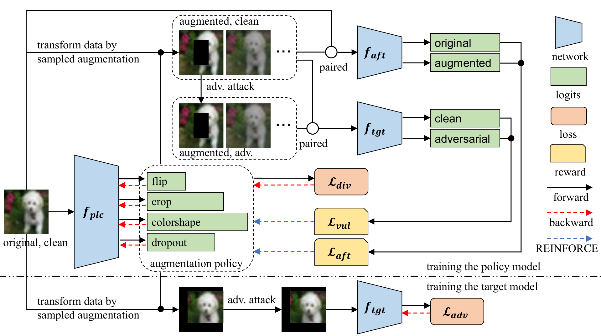

# AROID: Improving Adversarial Robustness Through Online Instance-Wise Data Augmentationn	

This is the official code repository of the paper titled "AROID: Improving Adversarial Robustness Through Online Instance-Wise Data Augmentation", which is accepted by the International Journal of Computer Vision in 2024.

* Arxiv: https://arxiv.org/abs/2306.07197

**[Abstract]** Deep neural networks are vulnerable to adversarial examples. Adversarial training (AT) is an effective defense against adversarial examples. However, AT is prone to overfitting which degrades robustness substantially. Recently, data augmentation (DA) was shown to be effective in mitigating robust overfitting if appropriately designed and optimized for AT. This work proposes a new method to automatically learn online, instance-wise, DA policies to improve robust generalization for AT. This is the first automated DA method specific for robustness. A novel policy learning objective, consisting of Vulnerability, Affinity and Diversity, is proposed and shown to be sufficiently effective and efficient to be practical for automatic DA generation during AT.



## 1. Preparation

### 1.1 Dependencies

The code was developed and well tested on the following configurations:

* Python 3.8.13
* PyTorch 1.11.0 + Torchvision 0.12.0

The remaining dependencies are specified in the file `requirements.txt` and can be installed via the following command:

```shell
pip install -r requirements.txt
```

### 1.2 Data

For training and test datasets, the simplest way to prepare the data is to add `--download` in the [training command](#3-training). The program will download the data files automatically and organize them in a ready-to-use way. Unfortunately, this functionality doesn't support the dataset Imagenette now. One need to manually download [Imagenette](https://s3.amazonaws.com/fast-ai-imageclas/imagenette.tgz) and move (extract) it into the directory `/data`.

For additional training data used in Tab. 7 in our paper, they need to be downloaded manually from [80K-TinyImages](https://github.com/yaircarmon/semisup-adv) and [BetterDiffusionModels](https://github.com/wzekai99/DM-Improves-AT). The downloaded data should be formulated as their original guidance and put under the directory `/data`.

### 1.3 Affinity Model

Training with AROID requires a pre-trained clean model, referred to as the "Affinity model" in our paper, to compute the Affinity metric. To assist in reproducing our reported results, we have provided the Affinity models used in our experiments [here](https://huggingface.co/TreeLLi/AROID). These models were trained using this repository. For example, the following command trains a WideResNet34-10 as the Affinity model:

```python
python src/train.py -a wresnet --depth 34 --width 10 --max_iter 0 --epochs 40 --annealing 20 30 -ei 0
```

The trained model will be saved in `model/trained/log/XXXX.pth.tar`. Finally, move the model to `/model/std/[DATASET]-[ARCH].pth.tar`, e.g., `CIFAR10-wrn34.pth.tar` for WideResNet34-10 on CIFAR10. Please refer to `/src/config/train.py` for the architecture names specified in the argument `std_ref`.

## 2. Pre-trained Robust Models

Please refer to this [Hugging Face sharepoint](https://huggingface.co/TreeLLi/AROID) for pre-trained robust models corresponding to the results reported in our paper.

## 3. Training

To reproduce our result of WideResNet34-10 on CIFAR10, run:

```bash
python src/train.py -l [LOG] -a wresnet --depth 34 --width 10 -aug auto --std_ref wrn34 --aff_coef 0.4 0.2 0.1 --div_coef 0.8 --div_limits 0.1 0.3
```

To reproduce our result of ViT-B/16 on Imagenette, run:

```bash
python src/train.py -l [LOG] -a vit-b -ps 16 -d inte --pretrained -wd 0.0001 --epochs 40 --annealing 36 38 --clip_grad -aug auto --aff_coef 0.3 --div_coef 0.8 --div_limits 0.2 0.3 -pb vit-b --std_ref vit-b --plr 0.1
```

There are many other arguments allowed to be specified in the running command in order to control the training. The shared arguments, between training and evaluation are stored in the `/src/config/config.py` and the task-specific arguments are defined in the corresponding configuration file under the `/src/config` folder. Please refer to the specific configuration file for the explanation and available options.

Each instance of training is tagged with a unique ID which is generated after the first epoch of training is finished. This ID is printed in the console when the training is completed or interrupted. It is used to identify the model checkpoint file and parameters log. The checkpoints will be saved during training in `model/trained/[LOG]`, where `[LOG]` is the name of the experiment logbook (by default, is `log`). By default, two variants of checkpoint are saved: `pgd` and `end` for "best" and "end" checkpoints (explained in our paper), respectively. Note that when `swa` training is enabled two more checkpoints will be saved as `swa_pgd` and `swa_end`. The log of training parameters is saved in the directory `/output/log/[LOG]`. 

## 4. Evaluation

To evaluate the accuracy and robustness of the "best" (`-v`) checkpoint of a model of ID `0000` in the logbook `[LOG]` (`-l`) against AutoAttack attack (`-a`), run:

```bash
python src/adversary.py 0000 -l [LOG] -v pgd -a aa
```

The evaluation results will be printed in the console and also updated in the corresponding log file in `/output/log/[LOG]`.

## 5. File Structure

* `data/`: dataset files
* `model/`: model checkpoints
  * `std/`: standardly trained checkpoints to be used as Affinity models
  * `trained/`: saved model checkpoints
* `output/`: experiment logs
* `src/`: source code
  * `train.py`: training models
  * `adversary.py`: evaluating adversarial robustness
  * `utils/`: shared utilities such as training, evaluation, log, printing, adversary, multiprocessing distribution
    * `train.py`: **implementation code of AT and AROID**.
  * `model/`: model architectures and loss
    * `policy_net.py`: the architecture of policy model.
  * `data/`: data processing
    * `policy.py`: policy sampling and sub-policy decoder
  * `config/`: configurations for training and adversarial evaluation

## 6. Citation

If you use this code in your research, please kindly cite the following paper

```bash
@article{,
    title={AROID: Improving Adversarial Robustness Through Online Instance-Wise Data Augmentation},
    author={Li, Lin and Qiu, Jianing and Spratling, Michael},
    journal={International Journal of Computer Vision (IJCV)},
    year={2024}
}
```

## 7. Acknowledgement

* the code of Wide ResNet is from [RobustBench](https://github.com/RobustBench/robustbench).
* the code of PreAct ResNet and SWA is from [Alleviate-Robust_Overfitting](https://github.com/VITA-Group/Alleviate-Robust-Overfitting).
* the code of AWP is modified from [AWP](https://github.com/csdongxian/AWP).
* the code of SCORE and TRADES is modified from [SCORE](https://github.com/P2333/SCORE) and [TRADES](https://github.com/yaodongyu/TRADES).
* the code of ViTs is from [When-Adversarial-Training-Meets-Vision-Transformers](https://github.com/mo666666/When-Adversarial-Training-Meets-Vision-Transformers).